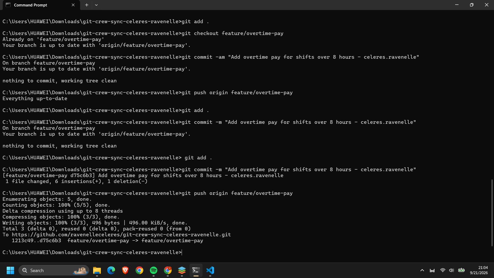
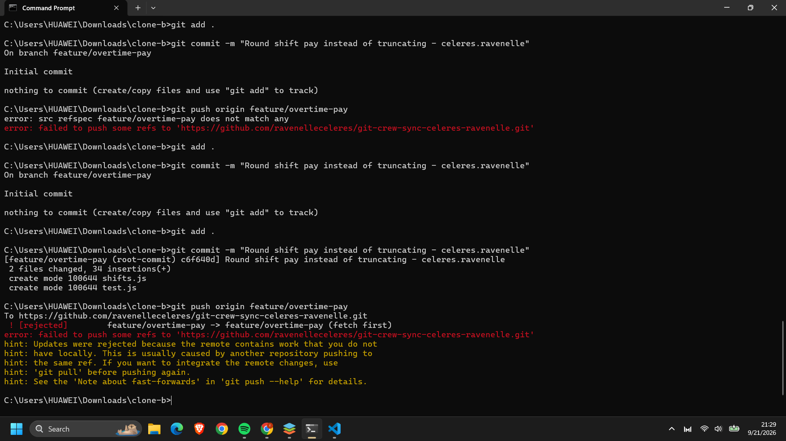
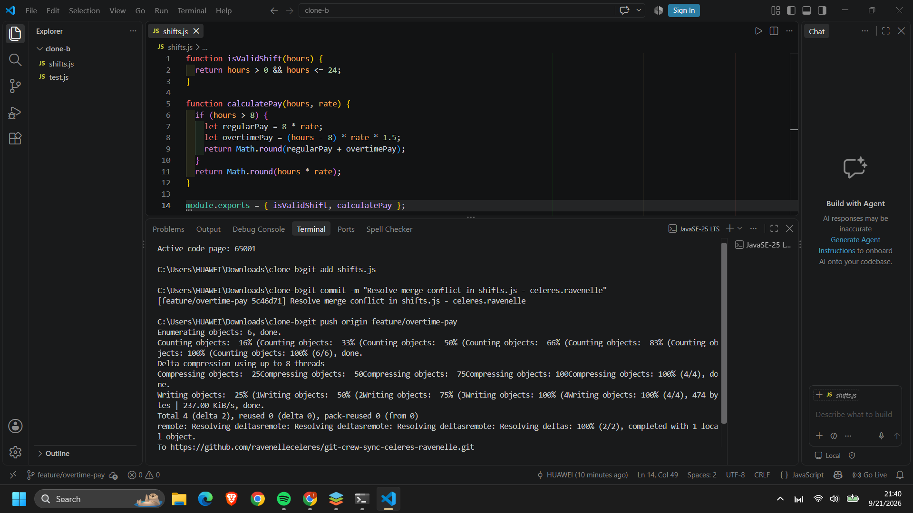
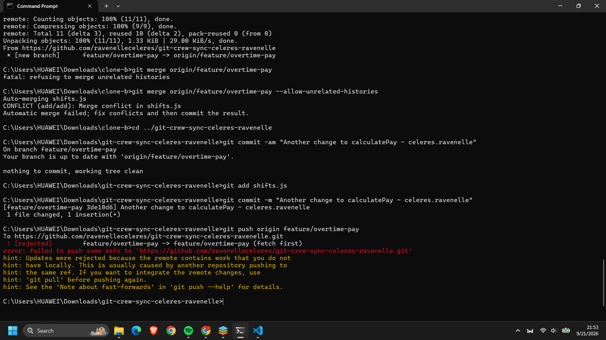
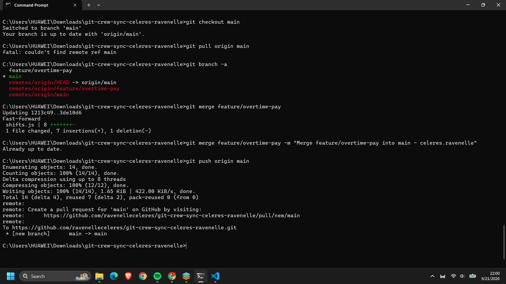
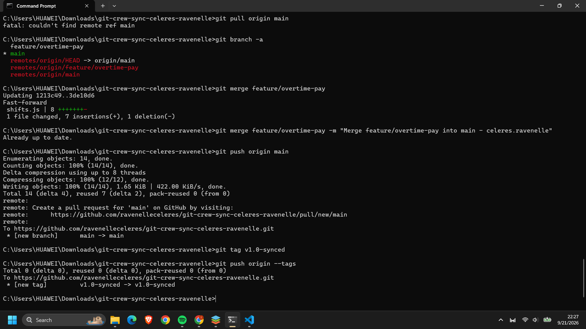

# Git Crew Sync Workflow Report

## Task 1 Evidence

## Task 2 Evidence

## Task 3 Evidence

## Task 4 Evidence

## Task 5 Evidence

## Task 6 Evidence

## Written Reflection
## 1. What did the rejected push error message tell you, and why did it happen?
The error message basically told us that the remote repo already had stuff in it that we didn't have yet because someone else pushed updates first. It happened because Git blocks you from pushing so you don't accidentally overwrite or delete someone else's hard work when the histories split up.

## 2. What's the actual difference between how you resolved Task 3 (merge) vs Task 4 (rebase)?
For Task 3 (merge), Git just mashed both histories together by making a new "merge commit" that kept everyone's timeline intact. For Task 4 (rebase), it temporarily took our local commits off, updated our branch to match the remote part, and then neatly stacked our changes right back on top so the history looked like one straight line without any messy merge commits.

## 3. What one habit would have avoided both rejected pushes in this lab?
Just remembering to run git pull to grab the latest updates from the remote repo before starting to code or trying to push anything would have saved us from both rejections.

## 4. Which approach - merge or rebase - would you default to on a shared team branch, and why?
I'd probably default to merging on shared team branches because it's safer and doesn't mess with or rewrite history that other people are already working on. Rebasing is cool, but it's really better just for cleaning up your own local commits before anyone else sees them.